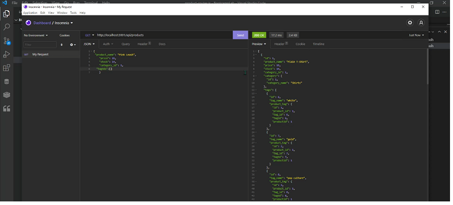

# ORM
# 13 Object-Relational Mapping (ORM): E-Commerce Back End


-----------------------------------------

## Table of Contents

* [Title](#Title:)
* [Description](#Description)
    * [Assignment Criteria](#Assignment_Criteria)
    * [Installation](#Installation)
    * [Usage of this project](#Usage_of_this_project)
    * [Who contributed](#Who_contributed)
    * [Features of this program:](#Features_of_this_program:)
* [link to video](#link-to-video)
* [Link to GitHub repository](#Link-to-GitHub-repository)
* [picture of page](#picture-of-page:)

--------------------------------------------------------------------------------    
### Title

Object-Relational Mapping (ORM): E-Commerce Back End

--------------------------------------------------------------------------------
### Description 

This is a database to store information about products with their categories and tags for backend inventory purposes of an ecommerce website, using Node.js, Inquirer, and MySQL.

--------------------------------------------------------------------------------
### Assignment Criteria

## User Story

```md
AS A manager at an internet retail company
I WANT a back end for my e-commerce website that uses the latest technologies
SO THAT my company can compete with other e-commerce companies
```

## Acceptance Criteria

```md
GIVEN a functional Express.js API
WHEN I add my database name, MySQL username, and MySQL password to an environment variable file
  THEN I am able to connect to a database using Sequelize
WHEN I enter schema and seed commands
  THEN a development database is created and is seeded with test data
WHEN I enter the command to invoke the application
  THEN my server is started and the Sequelize models are synced to the MySQL database
WHEN I open API GET routes in Insomnia Core for categories, products, or tags
  THEN the data for each of these routes is displayed in a formatted JSON
WHEN I test API POST, PUT, and DELETE routes in Insomnia Core
  THEN I am able to successfully create, update, and delete data in my database
```

--------------------------------------------------------------------------------
### Installation

You must install Node.js, npm inquirer, and MySQL.

--------------------------------------------------------------------------------
### Usage of this project

To add/update/delete products, categories, and tags for the ecommerce website.

--------------------------------------------------------------------------------
### Who contributed

Laura Brewer

---------------------------------------------------------------------------------
### link to video     

https://watch.screencastify.com/v/isCxtDX9v4BZOrRBN2vV

https://watch.screencastify.com/v/RvWIJoyqZOXakZcZzekm

https://watch.screencastify.com/v/ZjeWI83dDbIVKg0OQDQV

--------------------------------------------------------------------------------

### Link to GitHub repository 

https://github.com/ljbrewer/ORM

--------------------------------------------------------------------------------
### picture of page:



-------------------------------------------------------------------------------
#### Features of this program:

The server runs from the command line and then Insomnia can be used to view, add, update, and delete items in the product table, category table and the tag table.